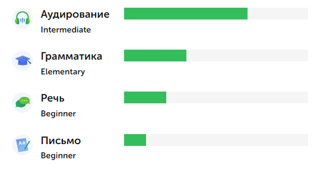

# **Daniel Geist**

## **Contact information:**
   + **E-mail:** geyst98@gmail.com
   + **Telegram:** [@godspowerr](https://t.me/godspowerr)
   + **WhatsApp:** +79537024463
   + **Discord:** yooguurt#5156
   + **GitHub:** [yooguurt](https://github.com/yooguurt)
  
---

## **Briefly About Myself:**
Throughout my life I have always been interested in computer technologies and their possibilities. I often helped my friends and acquaintances solve problems related to their devices.

Unfortunately, I did not have the opportunity to get an education related to IT technologies and I worked as a teacher at a school.
For a couple of years I was thinking about changing my field of activity and I got interested in Frontend development.
Now I left my previous job and began to study independently in the IT field.

I hope that my skills as a teacher will be useful on my way, and with my perseverance and desire, I will be able to achieve good results both on my own and with the help of a friendly community of programmers and in the future I will be able to become a full-fledged Frontend-developer.

---
## **Skills and Proficiency:**
  - Layout, HTML, CSS
  - JavaScript Basics
  - Git Basics, Git Extensions
  - VS Code
  - GitHub
  
---
## **Code example:**

> ### **Correct parenthesis closing**

The input is a string. It can contain opening and closing brackets `()` `{}` `[]`. You need to make sure that the sequence of opening and closing brackets is not violated, that is

1) An open bracket can only be closed with the same type of brackets

2) Nesting of brackets is not detected, that is, if a bracket is opened inside other brackets, then it will close within the parent brackets


```
function bracket() {
  const bracketString = document.querySelector("#thirdInput").value;
  let f = (str) => {
    const openBrackets = ["(", "{", "["];
    const closeBrackets = [")", "}", "]"];
    let stack = [];
    for (let i = 0; i < str.length; i++) {
      let b = str[i];
      if (openBrackets.includes(b)) {
        stack.push(openBrackets.indexOf(b));
      } else if (closeBrackets.includes(b)) {
        if (stack.length === 0 || closeBrackets.indexOf(b) !== stack.pop())
          return false;
      }
    }
    return stack.length === 0;
  };
  document.querySelector("#thirdQuest").innerText = f(bracketString);
}
```

> ### **Lucky number** 

A lucky number is a number that is described by the following process:

1) Starting from any value, we replace it with the sum of the squares of the digits from which this value is written

2) Repeat step 1 until the sum becomes equal to one (after which this value does not change), or the sum becomes equal to one and changes infinitely, but does not become equal to 1.

3) Those numbers that, as a result of repetitions of step 1, come to the value 1, are considered lucky.

```
function happyNumber() {
  const happyNumberStr = document.querySelector("#fourthInput").value;
  let happy = (str) => {
    let num = Number(str);
    if (num === 0) return false;
    for (let i = 0; i < 100; i++) {
      let sum = 0;
      while (num !== 0) {
        let a = Math.floor(num / 10);
        let b = num % 10;
        sum = sum + b**2;
        num = a;
      }
      if (sum === 1) return true;
      num = sum;
    }
    return false;
  };
  document.querySelector("#fourthQuest").innerText = happy(happyNumberStr);
}
```
> ### **Layout example**


---
## **Educational projects**

> ### **[Basics js-function in my GitHub](https://github.com/yooguurt/JS-scripts1)**

> ### **[Layout web-site 1 in my GitHub](https://github.com/yooguurt/layout1)**

> ### **[Layout web-site 2 in my GitHub](https://github.com/yooguurt/layout2)**

---
## **Courses:**
* ### In 2022, he completed an online course on the basics of JavaScript on the [code-basics.com](code-basics.com) platform

> ###  Link to my [JavaScript course](https://code-basics.com/ru/languages/javascript)

* ### I also get knowledge and advice from my friends, mentors of Frontend developers, who regularly share valuable experience with me.

---
## **Languages:**
+ ### English - A2+
  
+ ### Russian - Native
+ ### Germany - A2